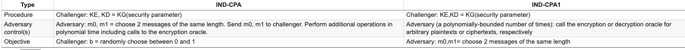

# Tabulated Data Markup Language (TDML) file into a CSV 

Converts a Tabulated Data Markup Language (TDML) file into a CSV file, stitching data column by column. This assumes TDML is structured as tabular data in a clear text format, rather than an XML-based format.

The script processes multiple TDML files (f1.tdml, f2.tdml, f3.tdml, etc.), automatically detecting them and converting them into a single CSV file. 🚀

